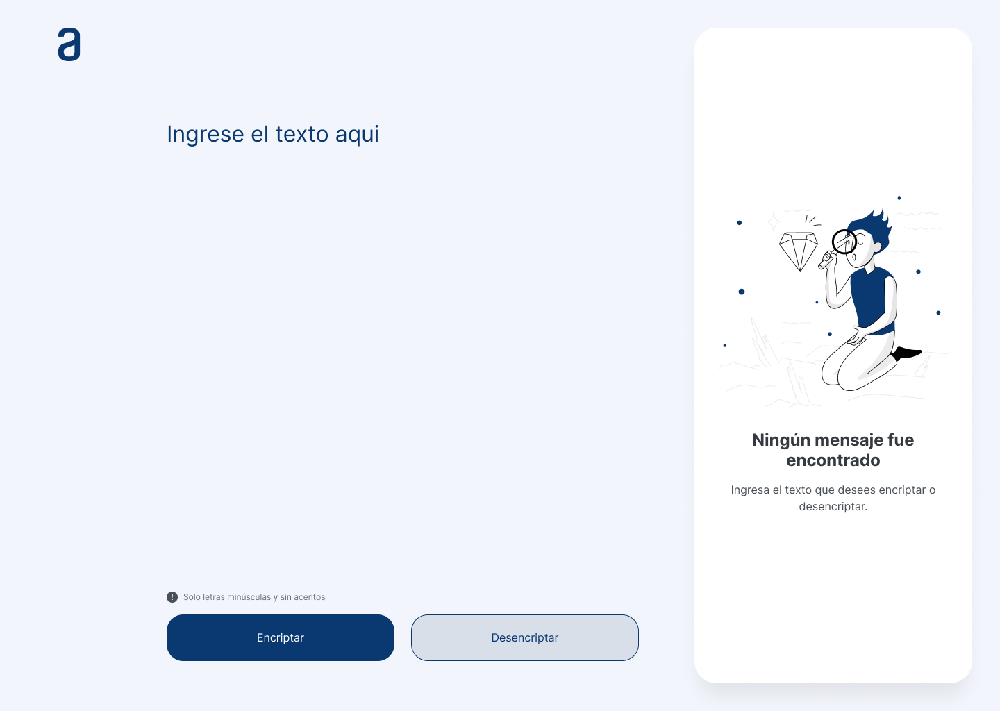

   

<h1 align="center"><b> Encriptador </b></h1>
<h3>Índice</h3>

- [Descripción](#descripción)

- [Aplicación](#aplicación)

- [Funcionalidad](#funcionalidad)

- [Herramientas utilizadas](#ferramentas-utilizadas)

## <h2><u>Descripción</u></h2>

Este encriptador es el primer challenge del programa de cursos Alura.

Contiene un campo para inserción del texto que será encriptado o desencriptado.

El Usuario Puede escoger entre las dos opciones.

## <h2><u>Aplicación</u></h2>

Version Escritorio

   

## <h2><u>Funcionalidad</u></h2>
El objetivo de la aplicacion es <b>encriptar</b> y <b>desencriptar</b> el texto ingresado utilizando "llaves" de encriptación 

## <h2><u>Herramientas</u></h2>

 